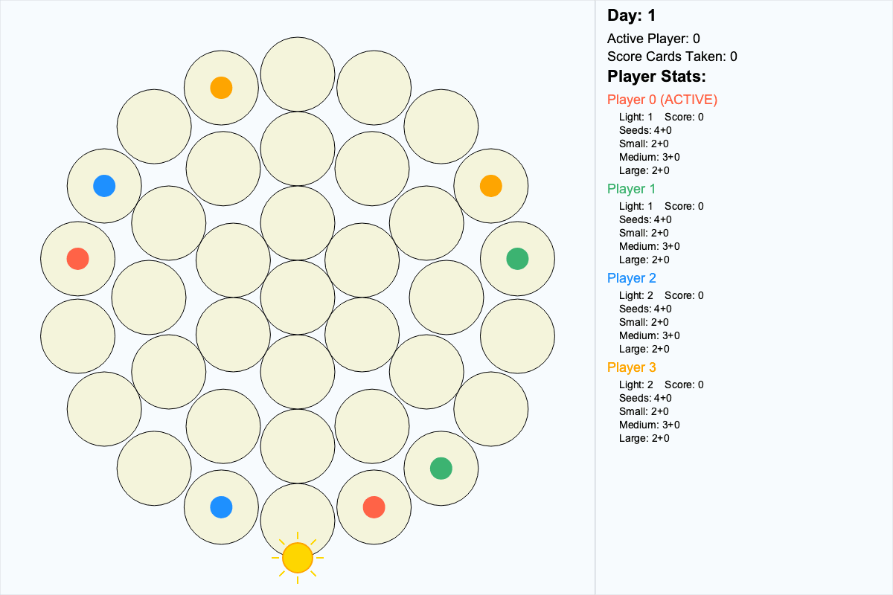
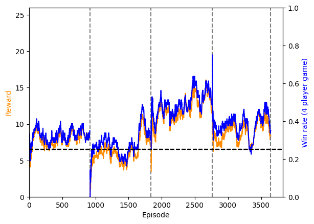

# ——— Photosynthesis AI ———

This is my repo in which I work on reinforcement learning algorithms to play the board game Photosynthesis. The aim is to produce the first AI to achieve superhuman performance in the game.

## Quickstart guide

Go to `src/psai/control/training_configs/default.json` and edit the training parameters.

Each round refers to a number of training timesteps run against fixed opponents. In the first round, the opponents are random agents that uniformly select from available actions. After that the agent is frozen at the end of a round and distributed to the other seats.

Then, run the training with:

```
brew install pipx
pipx ensurepath
pipx install poetry
cd PhotosynthesisAI
poetry run python src/psai/learn.train.py
```

This saves simple training logs in `logs/`. You can save detailed state logs with the `log_records()` method of the environment.

After running training, go to `notebooks/analysis.ipynb`. This automatically accesses the most recent logs subfolder and plots the reward curves. This also calls the visualiser to plot an animation of a game (currently this requires manually logging records with `log_records()`).

## Rules of the game

Due to copyright restrictions I won't be sharing photographs of the board or the rule book. However, I will describe them in brief below.

Photosynthesis is a four-player game played on a hexagonal grid of spaces. The aim is to get the highest score by the end of the game. Your score accumulates when a tree is _harvested_.

A game is separated into _days_ and _hours_.

In a given _hour_, a token representing the _sun_ is placed on one of the six corners of the board. All trees that can see the sun (and are not in the shadow of other trees), will get _light points_ for their owner.

A small/medium/large tree casts a shadow that is 1/2/3 spaces long.

On a player's turn they have various things that they can do, each costing a different number of light points:

1. Purchase and plant a seed (in the shadow of an existing tree) [1 LP].
2. Buy a seed/small/medium/large tree to move it from the "stash" to the "ready" zones [variable LP].
3. Grow a seed/small/medium tree from the to a small/medium/large tree [1/2/3 LP], as long as the new trees are in the "ready" section of the player's items.
4. Harvest a large tree [4 LP].
5. End turn.

A player may make as many actions as they want during their turn, but may not use the same cell more than once on a turn.

When a tree is harvested, the player gets a number of points that depends on how many other trees have already been harvested.

## Results

This section is a work in progress, and will be updated periodically as I improve the model.

Here is a gif of four agents playing the game:



Here is a reward curve during training:

